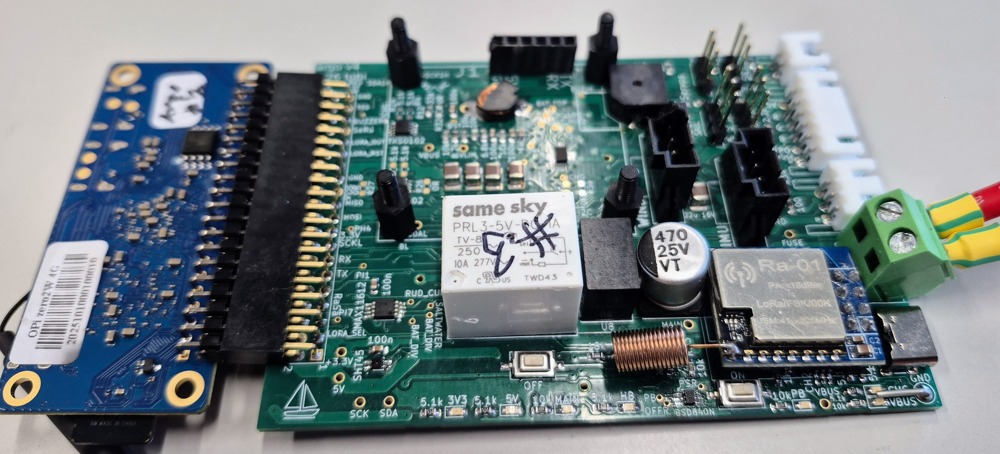

# PCB Design Files

This directory contains all the printed circuit board (PCB) design files, libraries, and documentation for the Argo autonomous sailboat project.

The design was done with KiCad version 9 stable.  
**It is important to use the stable version, not the development release, since KiCad will not open files from later versions!**  
- [Download KiCad stable here](https://www.kicad.org/download/)

## See also
Updated wind sensor design in [WindSensor](WindSensor).
## Current PCB
The current stable PCB [Argo PCB rev4](argo-v9-stable/argo-v9-stable-rev4) that will be tested at CapoCaccia 2026 is shown below, plugged into the OrangePiZero 2W. The only missing board is the GPS module, which sits on the standoffs. Note how the Ra-01 LORA module is soldered directly to the PCB to lower it to fit under the rudder winch. The white JST headers connect to water sensor, hatch power button with RGB LED, and 2S LiPo battery charger/balance cable. The large cables connect power from the LiPo battery, which sits alongside the keel/mast hull insert. The two black headers connect to the IMU on the rudder/winch servo chassis, and the wind sensor at the top of the mast. The board has a big white dual-coil power relay that completely cuts power when the boat is powered off.  The upper small black chip at lower left are the ADC that converts battery voltage, sail winch and rudder current, and water sensor voltage. The smaller chip below this is the humidity and PCB temperature sensor. The 4 large SMD caps at top left, below the inductor, are just to the left of the LiPo battery charger chip. The USB power input for charging is at lower right; it connects to the waterproof hatch USB port with a flex cable. Note how all cables exit on right because fore is the only available direction for connections; the PCB sits nestled up against the rudder insert and partly below the rudder/winch tray.

## Directory Structure

### `argo-v9-stable/`
The main PCB design files for the Argo v9 stable revision:
- **Schematic and PCB files**: KiCad project files for the main control board
- **3d-models/**: 3D model files for mechanical integration
- **Argo footprint Library.pretty/**: Custom KiCad footprint library with hand-solderable components
- **argo-v9-stable-backups/**: Archive of previous design iterations
- **argo-v9-stable-rev0/**: First revision manufacturing files (Gerber, drill files)
- **argo-v9-stable-rev1/**: Second revision manufacturing files
- **argo-v9-stable-rev2/**: Third revision (rev2) manufacturing files
- **argo-v9-stable-rev3/**: Current production (rev3) manufacturing files (fully functional, no modifications required)
- **bom/**: Bill of Materials (BOM) files including interactive HTML BOM

### `datasheets/`
Component datasheets and documentation:
- **AP33771C-Sink-Controller-EVB-User-Guide.pdf**: USB-C power delivery controller
- **CH224DS1.PDF**: USB-C configuration chip
- **DS-000189-ICM-20948-v1.3.pdf**: ICM-20948 9-DOF IMU sensor
- **LED button connections.png**: Wiring diagram for LED buttons
- **Ultra Short Push Button Switch...pdf**: Waterproof button specifications

### `images/`
Circuit diagrams, wiring schematics, and design documentation:
- **adc circuit.png**: ADC circuit design
- **argo gps serial.png**: GPS serial connection diagram
- **argo imu active.png**: IMU active connection diagram
- **CH224 cfg wiring.png**: USB-C configuration wiring
- **i2c addresses.png**: I2C device address mapping
- **power_switch.png**: Power switching circuit design

### `invoices/`
Purchase documentation and order records:
- **aliexexpress orders pin headers orangepi etc.pdf**: AliExpress component orders
- **farnell_order.pdf**: Farnell/Newark component orders

### `library_loader/`
KiCad library files and 3D models:
- **SamacSys_Parts.lib**: Component symbol library
- **SamacSys_Parts.pretty/**: Component footprint library
- **SamacSys_Parts.3dshapes/**: 3D model files for components
- **LIB_30R500UF.zip**: Additional component library

### `orange-pi/`
Orange Pi Zero 2W integration files:
- **orange_pi_zero_2w.kicad_sym**: KiCad symbol for Orange Pi Zero 2W
- **orange_pi_zero_2w_pins.lib**: Pin definition library
- **3d/**: 3D models for Orange Pi Zero 2W
- **H616_Datasheet_V1.0_cleaned.pdf**: Allwinner H616 SoC datasheet
- **OPi_ZERO_2W_SCH.pdf**: Orange Pi Zero 2W schematic
- **OPi_ZERO_2W_V1_1_1A pcb layout.pdf**: PCB layout reference

### `sparkfun/`
SparkFun component libraries and designs:
- **SparkFun_IMU_Breakout_ICM-20948/**: ICM-20948 IMU breakout board files
- **Sparkfun_IMU_ICM-20948.kicad_mod**: Custom footprint for ICM-20948
- **Sparkfun_NEO-M9N-SMA-scaled.kicad_mod**: GPS module footprint
- **SparkFun-GPS.kicad_sym**: GPS module symbol

## Key Components

### Main Control Board (Argo v9)
- **Microcontroller**: Orange Pi Zero 2W (Allwinner H618)
- **Power Management**: USB-C PD controller (AP33771C), power switching
- **Sensors**: 
  - GPS: u-blox NEO-M9N
  - IMU: ICM-20948 9-DOF
  - Wind: 3x Sensirion SDP3x differential pressure
  - Environment: SHT45 temperature/humidity
  - Battery/Water: MAX11612 ADC
- **Interfaces**: I2C, UART, PWM capture/output, USB-C

### Design Philosophy
- **Hand-solderable components**: All footprints designed for manual assembly
- **Waterproof design**: Sealed enclosure with waterproof connectors
- **Modular architecture**: Separate sensor modules for easy maintenance
- **Robust power management**: Multiple power sources with automatic switching

## Manufacturing

### Revision History
- **Rev 0**: Initial prototype
- **Rev 1**: Improved layout and component placement
- **Current**: v9-stable (production ready)

### Manufacturing Files
Gerber files and drill data are located in:
- `argo-v9-stable-rev0/` - First revision
- `argo-v9-stable-rev1/` - Second revision

### Assembly Notes
- All components are hand-solderable

## Development Tools

### KiCad Version
- **Recommended**: KiCad 9.0 or later
- **Footprint Library**: Custom "Argo footprint Library" with hand-solderable components
- **Symbol Library**: SamacSys_Parts.lib for standard components

### 3D Models
- **Mechanical Integration**: A few 3D models available for enclosure design
- **Component Models**: STEP files for major components
- **Assembly Verification**: Use KiCad 3D viewer for clearance checking

## Documentation

### Circuit Design
- **Power Management**: USB-C PD with automatic switching
- **Sensor Integration**: I2C bus with proper pull-ups and filtering
- **Signal Integrity**: Proper grounding and power distribution
- **EMC Considerations**: Shielding and filtering for marine environment

### Testing and Validation
- **In-Circuit Testing**: Test points provided for key signals
- **Functional Testing**: Validation procedures for each subsystem
- **Environmental Testing**: Waterproof and vibration testing

## Contributing

When modifying PCB designs:
1. Update version numbers in filenames
2. Document changes in commit messages
3. Update BOM files
4. Test thoroughly before marking as stable
5. Archive previous versions in backup folders

## Related Documentation

- **Main Project README**: `/README.md` - Overall system documentation
- **Nodes README**: `/nodes/README.md` - Software documentation
- **Power Control README**: `/launch/ARGO_POWER_CONTROL_README.md` - Power management details
