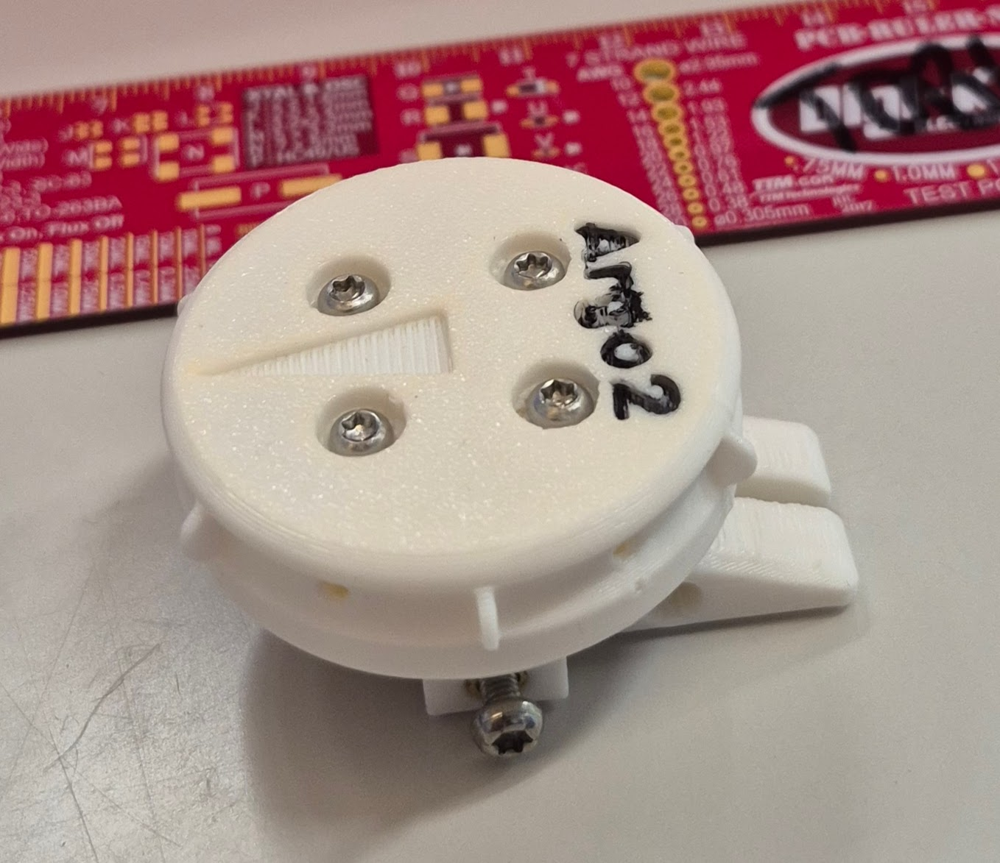
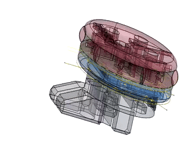
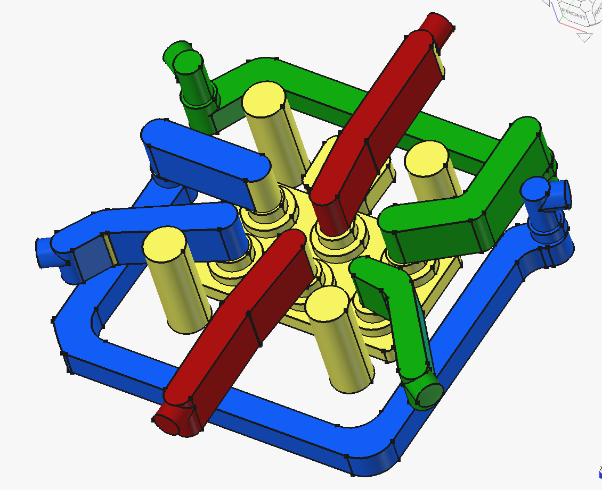
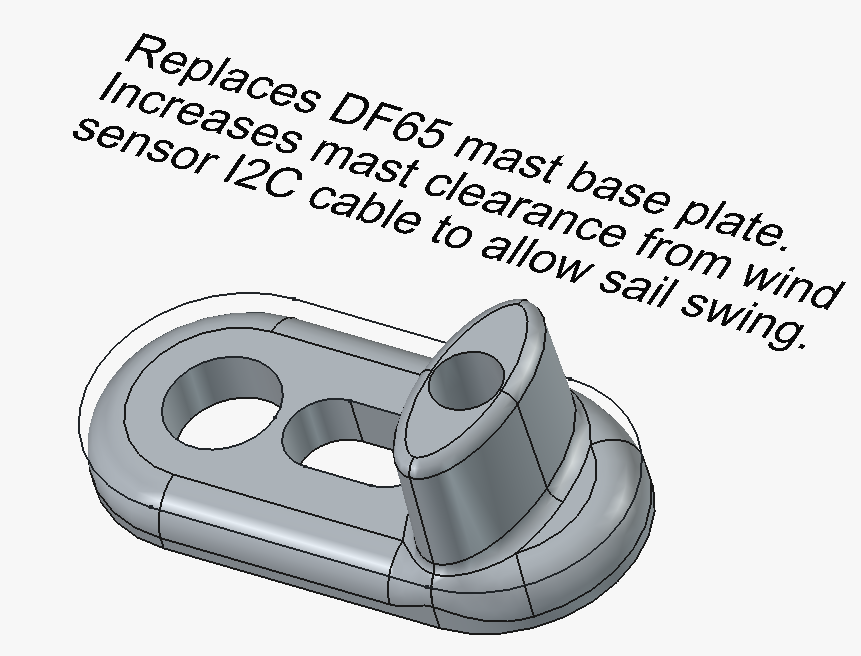
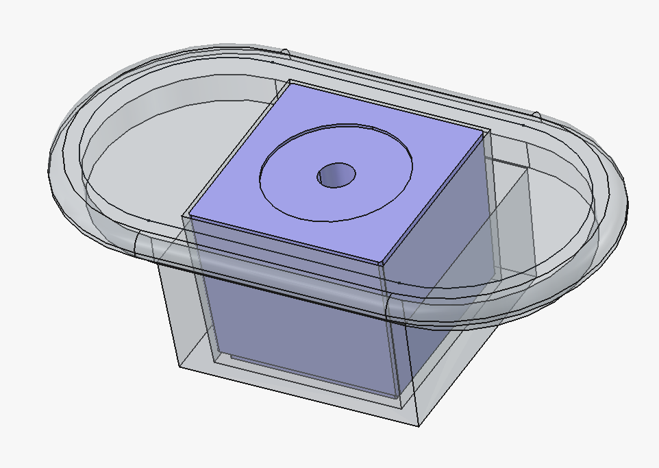
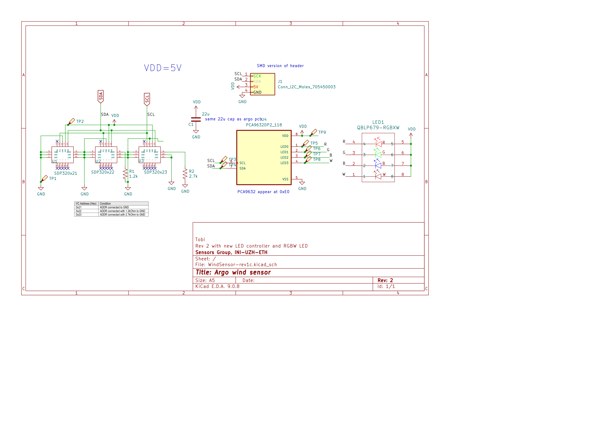
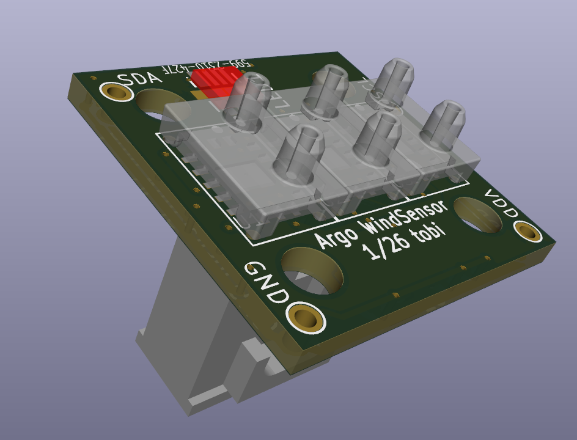
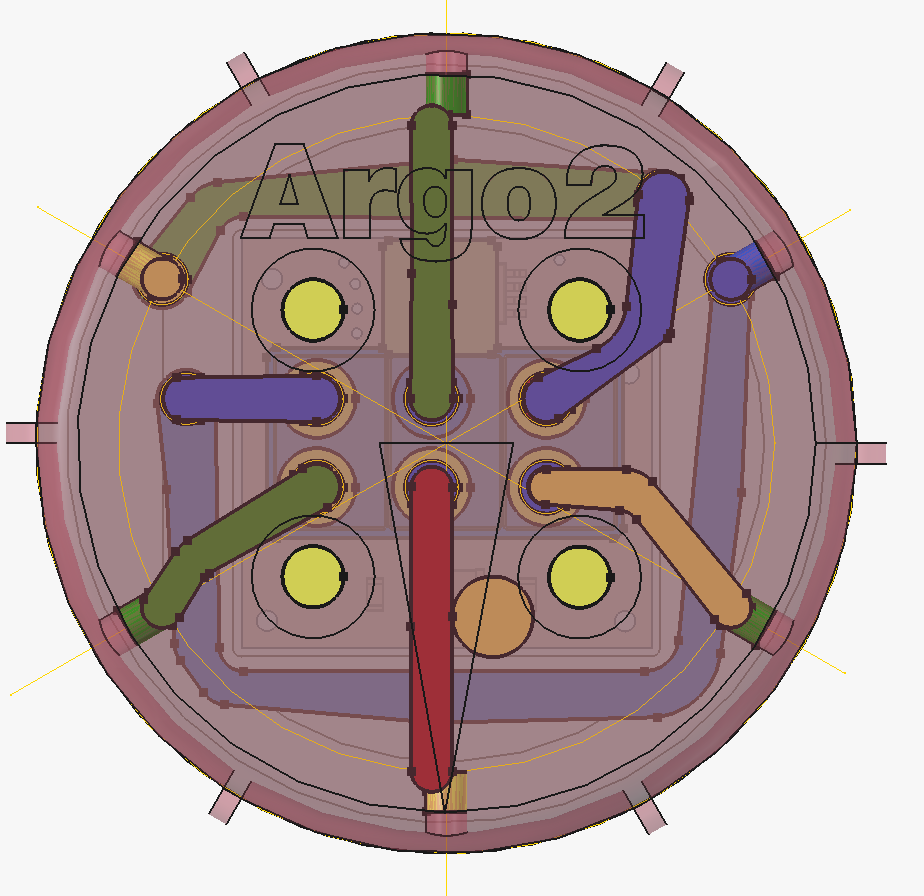

# Argo Wind Sensor - Revision 1

## Overview

This is the Argo Wind Sensor PCB and 3D printed case design, including the boat hull housing cable gland entry and the replacement mast base part that increases the mast clearance over the deck to allow room for the cable gland. The wind sensor is designed to measure wind speed and direction for the Argo sailboat. 

It is based on Sensiorion reference design (since removed from sensorion because the page could not be migrated). Sensirion kindly supplied the step file as a starting point for the current design. The current design is combined with a mast mounting part that clamps to the mast backstay carbon fiber part.

The PCB design includes 3 SDP32 differential pressure sensors and 
an RGBW LED controller with RGBW LED. Sensors and LED controller are on the Argo I2C bus and are connected to Argo's computer via the 4-wire cable through the Molex SL-series SMD header. The mast mount part includes a set screw to provide strain relief for the SMD Molex header.

The PCB was designed in Kicad 9. The housing was designed in FreeCAD 1.1rc2.

The PCB was fabricated by JLCPCB.

See the argo ROS2 nodes anem.py and mastled.py for sensing and control of the wind sensor.

## Images

These images show a sample of the wind sensor housing and its design. The right image shows the air pipes from Sensirion SDP32 differential pressure sensors to the air pitot openings. 

<table>
  <tr>
    <td align="center">
      <b>Wind Sensor Housing Photo</b> 
      
    </td>
    <td align="center">
      <b>3D Turntable GIF</b> 
      
    </td>
    <td align="center">
      <b>Air Passages</b> 
      
    </td>
  </tr>
</table>

### Additional parts
<table>
  <tr>
    <td align="center">
      <b>Mast Step Up (1cm)</b> 
      
    </td>
    <td align="center">
      <b>Cable Gland Housing</b> 
      
    </td>
  </tr>
</table>

#### Hull entry cable gland
The 3D design of the cable gland hull entry through DF65 battery charger opening is part of the 3D FreeCAD design of the WindSensor.
- **Cabling**: I2C cable, Digikey Part: [839-30-00099-DS-ND](https://www.digikey.ch/en/products/detail/tensility-international-corp/30-00099/24671435)
  - **Description**: CBL 4CON 28AWG SHLD WHT 1M  
    - 4-conductor (1 pair twisted), Multi-Conductor Cable, White, 28 AWG  
    - Shielded (Foil, Braid)  
    - Length: 1.00m (3.28')  
    - Outer Diameter: 3.6mm  
    - 4 (1 Pair Twisted) Conductor Multi-Conductor Cable White 28 AWG Foil
  - **Datasheet**: [30-00099 (PDF)](https://tensility.s3.us-west-2.amazonaws.com/imports/product_spec_sheets/30-00099.pdf)
  - **Supplier**: digikey.ch  
  - **Approx. Price**: 2.62 CHF/m
- **Cable Gland**: Waterproofing cable guard for I2C cable entry  
  - **Part Number:** 281-3860-ND  
  - **Manufacturer:** Weidmüller (2583400000)  
  - **Supplier:** [Digi-Key](https://www.digikey.ch/products/de?keywords=281-3860)  
  - **Description:** Water-resistant cable entry for wind sensor I2C connection  
  - **Type:** Square Frame Grommet, Split  
    - Frame Size: 0.815" (20.70mm)  
    - Cable Range: 0.118" ~ 0.157" (3.00mm ~ 4.00mm)  
    - Color: Gray  
  - **Price:** ~3.70 CHF (digikey.ch)

#### Mast step up
The mast is raised by 1cm to allow clearance of the main sail boom over the cable gland housing. The 3D design of this replacement for the standard DF65 mast base plate is part of the WindSensor 3D design in FreeCAD.

## PCB and specifications

### PCB Views

  <b>WindSensor PCB 3D View (PCB dims 20x20mm)</b> 
  

  <b>WindSensor PCB Schematic</b> 
  

  <b>WindSensor PCB Layout(PCB dims 20x20mm)</b> 
  

  <b>WindSensor PCB Layout(PCB dims 20x20mm)</b> 
  

Sensors are numbered left to right on the PCB. On every SDP32, the **upper** (windward) port is wired to the **negative** (−) pressure port; I2C reports P(+) − P(−), so headwind on the center tube gives **negative** raw readings. The ±120° pitot paths invert sign relative to the center sensor. `anem.py` negates CTR only; CW/CCW keep raw sign.

| Label | I2C address | Angle (looking down on mast) | `anem.py` sign (after offset subtract) |
|-------|-------------|----------------------------|----------------------------------------|
| CW    | 0x21        | +120° (clockwise from bow) | × +1 (routing inverted vs CTR)         |
| CTR   | 0x22        | 0° (bow/stern)             | × −1 (negate I2C; − port on upper)     |
| CCW   | 0x23        | −120° / 240° CCW from bow  | × +1 (routing inverted vs CTR)         |

### Electrical
- **Supply Voltage**: 5V
- **Operating Current**: About 160mA max (3 LEDS, each max 50mA)
- **Communication Interface**: I2C

### Physical
- **Board Dimensions**: 20x20mm
- **Number of Layers**: 2
- **Surface Finish**: ENIG
- **Connector**: Molex SL series SMD. Strain relief to wind sensor housing base mast mounting part via posts and M3 set screw.

## Design Files

This directory contains:
- Schematic files (`.kicad_sch` Kicad Version 9)
- PCB layout files (`.kicad_pcb` ) 
- 3D models (if applicable)

## Bill of Materials (BOM)

The BOM is generated from Kicad
Parts include datasheet links and Digikey or Farnell part links.

## Manufacturing

### Gerber Files
Gerber files are generated from kicad in the `gerbers/` directory. These can be sent directly to a PCB manufacturer.

### Fabrication Notes
- Minimum trace width: 0.2mm
- Minimum via size: 0.3mm

## Known Issues

- None currently documented for Rev 1

## Revision History

### Rev 1 (Initial Release)
- 2nd version of PCB
- Date: Feb 2026

### Rev 0 
- Initial design done by ETH semester student Andrea Mock
- Date: ca. 2019
- Based on Sensirion reference design, no longer available

## Contact

For questions or issues related to this PCB design, please contact Tobi Delbruck.

## Credits
Thanks to Sensirion (Alex Roos and colleagues) for making the original Sensirion prototype step file avaialable again to enable rev 1.
## License

Same as argo project.
