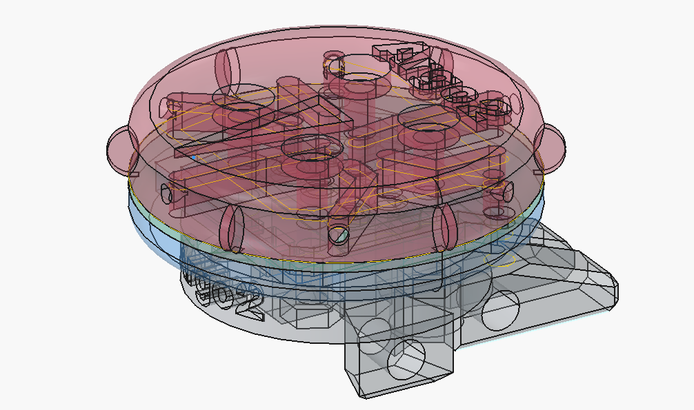

# Argo Wind Sensor - Revision 1

## Overview

This is the Argo Wind Sensor PCB and 3D printed case design, including the boat hull housing cable gland entry and the replacement mast base part that increases the mast clearance over the deck to allow room for the cable gland. The wind sensor is designed to measure wind speed and direction for the Argo sailboat. 

It is based on Sensiorion reference design (since removed from sensorion because the page could not be migrated). Sensirion kindly supplied the step file as a starting point for the current design. The current design is combined with a mast mounting part that clamps to the mast backstay carbon fiber part.

The PCB design includes 3 SDP32 differential pressure sensors and 
an RGBW LED controller with RGBW LED. Sensors and LED controller are on the Argo I2C bus and are connected to Argo's computer via the 4-wire cable through the Molex SL-series SMD header. The mast mount part includes a set screw to provide strain relief for the SMD Molex header.

The PCB was designed in Kicad 9. The housing was designed in FreeCAD 1.1rc2.

The PCB was fabricated by JLCPCB.

See the argo ROS2 nodes anem.py and mastled.py for sensing and control of the wind sensor.

## Images

### 3D Model

### Housing Design

### Hull entry cable gland
See Wiedmuller part below. The 3D design of the cable gland hull entry through DF65 battery charger opening is part of the 3D FreeCAD design of the WindSensor.

### Mast step up
The mast is raised by 1cm to allow clearance of the main sail boom over the cable gland housing. The 3D design of this replacement for the standard DF65 mast base plate is part of the WindSensor 3D design in FreeCAD.

## Specifications

### Electrical
- **Supply Voltage**: 5V
- **Operating Current**: ~160mA max (3 LEDS, each max 50mA)~
- **Communication Interface**: I2C
- **Cabling**: I2C cable, Digikey Part: [839-30-00099-DS-ND](https://www.digikey.ch/en/products/detail/tensility-international-corp/30-00099/24671435)
  - **Description**: CBL 4CON 28AWG SHLD WHT 1M  
    - 4-conductor (1 pair twisted), Multi-Conductor Cable, White, 28 AWG  
    - Shielded (Foil, Braid)  
    - Length: 1.00m (3.28')  
    - Outer Diameter: 3.6mm  
    - 4 (1 Pair Twisted) Conductor Multi-Conductor Cable White 28 AWG Foil
  - **Datasheet**: [30-00099 (PDF)](https://tensility.s3.us-west-2.amazonaws.com/imports/product_spec_sheets/30-00099.pdf)
  - **Supplier**: digikey.ch  
  - **Approx. Price**: 2.62 CHF/m
- **Cable Gland**: Waterproofing cable guard for I2C cable entry  
  - **Part Number:** 281-3860-ND  
  - **Manufacturer:** Weidmüller (2583400000)  
  - **Supplier:** [Digi-Key](https://www.digikey.ch/products/de?keywords=281-3860)  
  - **Description:** Water-resistant cable entry for wind sensor I2C connection  
  - **Type:** Square Frame Grommet, Split  
    - Frame Size: 0.815" (20.70mm)  
    - Cable Range: 0.118" ~ 0.157" (3.00mm ~ 4.00mm)  
    - Color: Gray  
  - **Price:** ~3.70 CHF (digikey.ch)

### Physical
- **Board Dimensions**: 20x20mm
- **Number of Layers**: 2
- **Surface Finish**: ENIG

## Design Files

This directory contains:
- Schematic files (`.kicad_sch` Kicad Version 9)
- PCB layout files (`.kicad_pcb` ) 
- 3D models (if applicable)

## Bill of Materials (BOM)

The BOM is generated from Kicad
Parts include datasheet links and Digikey or Farnell part links.

## Manufacturing

### Gerber Files
Gerber files are generated from kicad in the `gerbers/` directory. These can be sent directly to a PCB manufacturer.

### Fabrication Notes
- Minimum trace width: 0.2mm
- Minimum via size: 0.3mm

## Known Issues

- None currently documented for Rev 1

## Revision History

### Rev 1 (Initial Release)
- Initial PCB design
- Date: TBD

### Rev 0 (initial design done by ETH semester student Andrea Mock, ca 2019)

## Contact

For questions or issues related to this PCB design, please contact Tobi Delbruck.

## License

Same as argo project.
